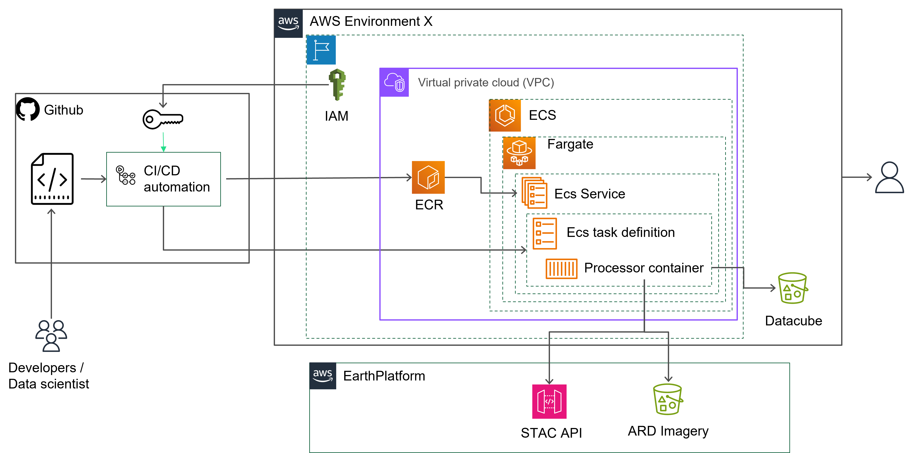
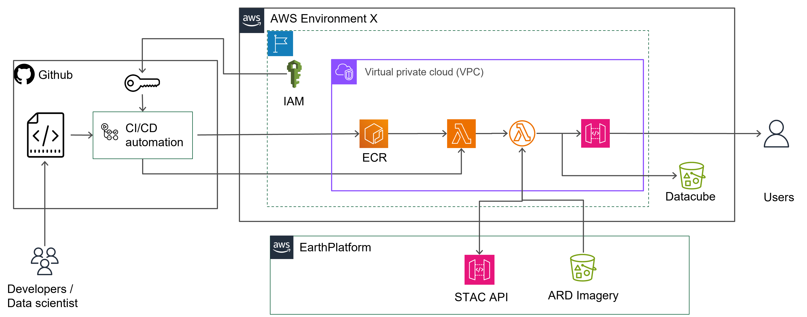

# Analytics Datacube Processor
Processors can be deployed on your infrastructure, using optimized easy-to-use templates.
You can also choose to use your own CI/CD pipelines.

The following documentation will guide you through, step-by-step, to get, customize and deploy the Analytics Datacube Processor including:

 - Provision AWS resources
    - Set up an identity provider for Github
    - Set up ECR in AWS
    - Create an ECS cluster, a service and a task definition in AWS
 - Configure depplyment workflow
    - Build and publish the docker image to ECR
    - Download and update a task definition
    - Update service with latest release

## Use cases

Vegetation index maps like NDVI or NDWI serves as a vital dataset for many applications including regenerative agriculture, insurance or food security and overall agriculture digitization. Many models and decision support tools leverage vegetation indexes to remotely to extract information and knowledge on the status of the soil or the crop during growing season. 

The Analytics Datacube Processor will ease deployment of analysis field level vegetation index pipeline supporting modeling effort either at early stage with model design and training but also model serving with fresh and up to date pixels.

The Analytics Datacube Processor will ease the creation of multi dimensional dataset based on geometries of interest, without the need to download the full satellite images. The processor is leveraging cloud native geospatial capabilities to:

- Select pixels of interest based on temporal (date range) and spatial criterias (geometry)
 - Apply cloud filter to get only clear pixels and leverage our [premium cloud mask](https://github.com/earthdaily/Studies-and-Analysis/tree/main/Auto-Cloud-Mask-Accuracy)  
 - Merge and cross calibrate data from several sources (for example Landsat and Sentinel)
 - Compute selected vegetaion indexes
 - Format data as Zarr asset
 - Publication to cloud storage
 
 >In geospatial data analysis, [Zarr](https://zarr.dev/) is one of these newly adopted data formats specifically for N-Dimensional arrays. It is an effective way to store large N-dimensional data in the cloud and access chunks.

Here are two examples of study leveraging pixel selection over fields:
  - for [Vegetation indexes for tillage detection](https://www.sciencedirect.com/science/article/pii/S2095633915301209)
  - for [yield modeling](https://link.springer.com/article/10.1007/s00484-023-02478-4)

## Architecture

### AWS ECS

This is the reference architecture for a deployment on ECS. 

### AWS Lambda

This is the reference architecture for a deployment on Lambda. 

